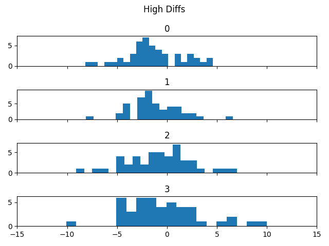
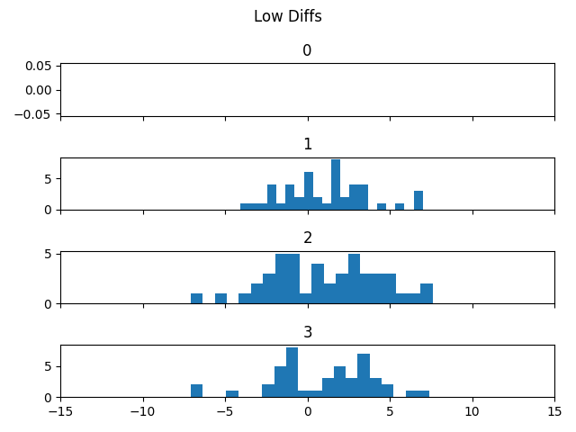

# wxstat - Weather Forecast Statistics

Tracks forecast high/low temps compared to actuals. Charts histograms on difference between forecast temps and actuals based on number of days between forecast and actual. Objective was to find out how accurate the temp forecasts are for a given location, and also determine if a some other consideration may apply e.g. constant temp differential between forecast location and actual location.

## Files

- **capactuals.py**: captures current data for high temp and low temp, is designed to pull data from a WeeWx designed page
- **capfcasts.py**: captures forecast data for high temp and low temp each day, is designed to pull data from standard NWS location forecast page
- **plt_hist.py**: plots the histograms comparing forecast to actual
- other files: datatypes, io functions and config etc.

## config.yaml

Various filepaths need defined in ```config.yaml```. Check ```config.py``` for the definitions needed.

## Warning

This application breaks easily and doesn't account for non-typical forecast elements in the NWS page among other things.

## Sample statistics images



